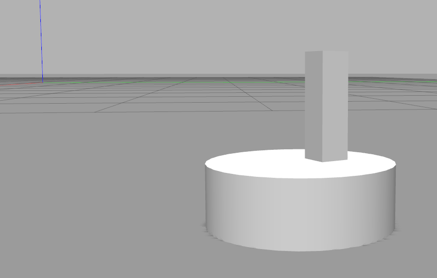
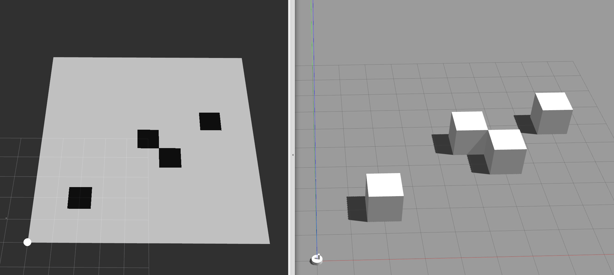

### Installation
```sudo apt install ros-humble-ros2-control ros-humble-ros2-controllers ros-humble-gazebo-ros2-control```

Create a new workspace, copy the package to the new workspace and run the launch file after building the workspace


### Usage
Launch the simulation using ```ros2 launch vacumoon_simulation launch_sim.launch.py ```



##### Move the robot

```
ros2 topic pub /position_forward_controller/commands std_msgs/msg/Float64MultiArray "{
  layout: {
    dim: [],
    data_offset: 0
  },
  data: [1.0, 3.0, 3.14]
}"

```
The first entry of the data field contains where to go in x-direction, the second where to go in y-direction and the third describes the orientation of the robot around the z-axis.


##### Move the arm

```
ros2 topic pub --once /joint_trajectory_controller/joint_trajectory trajectory_msgs/msg/JointTrajectory "{
  header: {
    stamp: {sec: 0, nanosec: 0},
    frame_id: ''
  },
  joint_names: ['arm_joint'],
  points: [
    {
      positions: [0.2],
      velocities: [0.0],
      accelerations: [0.0],
      time_from_start: {sec: 1, nanosec: 0}
    }
  ]
}"

```

##### Change the world
To load a different world from the worlds folder change the it in the launch file.

##### Commanding a goal pose
- Install the map server to load a png as a map: ```sudo apt install ros-humble-nav2-map-server```
- Open ```rviz2```
- File -> Open Config -> vacumoon_simulation/config/map.rviz2
Check the *map.yaml* to configure which png will be loaded as a map
```
ros2 run nav2_map_server map_server --ros-args -p yaml_filename:=worlds/map.yaml
```
```
ros2 lifecycle set /map_server configure
ros2 lifecycle set /map_server activate
```
The map is now shown in rviz:



- By clicking on **2D goal pose** in the rviz toolbar, you can command a goal pose for your robot to the */goal_pose* topic. The goal pose will be visualized by an arrow on the map.
